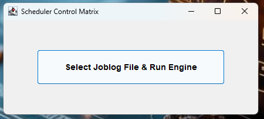
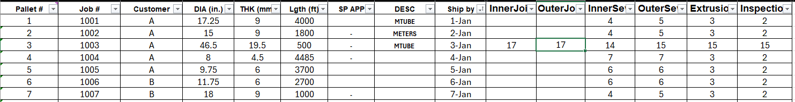
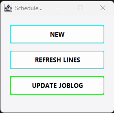
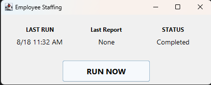

# 🛠️ Production Schedule Automation System

## Overview

A Java-based desktop application that automates production scheduling and workforce staffing across multiple manufacturing lines. The system minimizes scheduling conflicts, optimizes line assignments, assigns qualified employees, and preserves manual supervisor overrides when operational adjustments are required.

---
## Screenshots

### Scheduler Control Matrix

The application's main entry point allows supervisors to load a production job log and execute the scheduling engine.

---
### Production Job Log

The scheduling engine processes manufacturing specifications, production requirements, and scheduling constraints to generate line assignments and optimized production schedules.

---
### Supervisor Control Panel

The supervisor interface provides tools for creating new schedules, updating existing schedules, and saving finalized production plans.

---
### Attendance & Staffing System

The attendance interface automates staffing using current attendance, employee qualifications, and production-line priorities. It displays the previous and upcoming staffing runs, provides a live countdown to the next scheduled run, and allows supervisors to manually initiate staffing when needed.

---
## The Problem 

Managing job sequencing across multiple manufacturing lines relied on an manual tracking. This could lead to workflows suffering from scheduling collisions, overlapping line assignments, and critical overhead bottlenecks.

---
## The Solution 

Developed a Java automation system that dynamically maps production grids, assigns jobs based on production requirements, and streamlines multi-line scheduling while maintaining the flexibility for supervisor intervention when necessary.

---
## Features

- Job assignment based on specifications and special cases
- Automated production scheduling
- Multi-line job management
- Automated operator and stacker assignments
- Supervisor scheduling interface
- Excel import and export

---
## Technologies

- Java (VS Code)
- Java Swing
- Object-Oriented Programming (OOP)
- Microsoft Excel 
- Git/Github

---
## Production Scheduling Workflow

1. Import a production job log from a master Excel workbook.
2. Analyze manufacturing specifications and production requirements.
3. Validate scheduling constraints.
4. Generate optimized line assignments.
5. Review or modify assignments using the Supervisor Control Panel.
6. Save the finalized production schedule.
   
---
## Attendance & Staffing Workflow

1. Import the employee attendance report from CSV.
2. Match clocked-in employees to qualification records using badge numbers.
3. Load employee shift, main-line, and additional line qualifications.
4. Determine which production lines need to run.
5. Rank running lines according to current production priorities.
6. Assign qualified operators and stackers to prioritized production lines.
7. Generate the final staffing plan for the shift.

---
## Architecture

The application is organized into several core classes:

- **Job** – Represents an individual production job.
- **Line** – Models a manufacturing line.
- **Employee** – Represents employee attendance, qualifications, shift, and staffing information.
- **ProcessStep** – Represents individual processing stages.
- **JobLoader** – Imports scheduling data.
- **EmployeeImporter** – Imports attendance and employee qualification information.
- **Scheduler** – Coordinates production scheduling logic.
- **StaffingEngine** – Assigns available and qualified employees to production lines.
- **ExcelHandler** – Reads and writes Excel files.
- **ExcelTransactions**- Handles Excel-related operations
- **RunningLines** – Determines and prioritizes production lines that need to run.
- **SupervisorWidget** – Provides the user interface for supervisor interactions.
- **AttendanceWidget** – Provides the attendance and workforce staffing interface.
  
---
## Author

**David Hubbard**

B.S. Computer Science  
Jacksonville State University

GitHub: [https://github.com/DHubb23](https://github.com/DHubb23)
